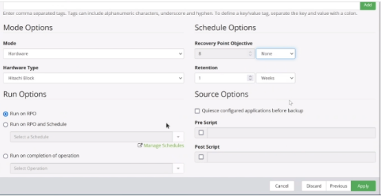
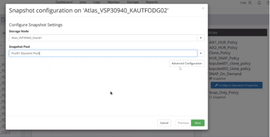
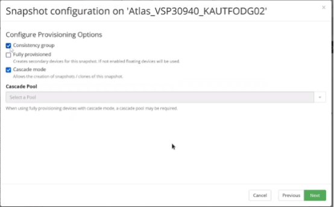
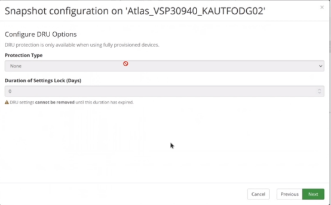

### CREATE SNAPSHOT
---
---

#### Create Hitachi Block Storage
---

1. **Nodes** → **+** → **Storage** → **Hitachi Block Device** → **Next**
2. Provide **Node Name** → **Confirm** → **Next**
3. Select **Proxy Node** → **Next**
4. Select **Metadata directory** → **Next**
5. Select **Storage Serial Number** → **Provide User/Password** → **Next**
6. Do not enable **CM-REST** for reporting → **Next**
7. Select **All** for **LDEV range** → **Next**
8. Select **Command Device** → **Next**
9. **Finish**
10. **Menu** → **Storage** → Select Storage → **Refresh**

#### Create Hitachi Block Host
---

1. **Nodes** → **+** → **Host** → **Hitachi Block Host** → **Next**
2. Provide Node Name → **Next**
3. Do not select **Resource Group** → **Next**
4. Select **Block Device** (Storage) → **Next**
5. Type included and/or excluded **LDEVs** → **Next**
6. **Finish**

#### Create Policy
---

1. **Policy** → **+** → Provide **Name** → **Next**
2. Do not select **Resource Group** → **Next**
3. Add one or more **classification** → **+**
4. **Physical** → **Hitachi Block** → **Next**
5. Select **Use Hitachi Block Host Selections** → **Next**
6. **Next**
	

7. Add one or more **operation** → **+**
8. **Snapshot** → **Next**
9. Configure **Snapshot**
	
	Retention: Time to keep snapshot
	On Demand Snapshot: Run on RPO & RPO None + Quiesce disabled
	Periodic Snapshot: Run on RPO & and set RPO + Quiesce disabled
	Scheduled Snapshot: Run on RPO and Schedule & RPO None + Quiesce disabled
10. **Apply**
11. **Finish**

#### Create & Execute Data Flow
---
---

1. **Data Flows** → **+** → Provide **Name** → **Next**
2. Do not select **Resource Group** → **Next**
3. Select **Block Host** → Drag & Drop
4. Click **Block Host** & Select **Snapshot** policy from right corner
5. **Policies** → Select **Snapshot** → Click **Configure Operation Properties**
6. Configure **Snapshot Settings**
	1. **Storage Node**: Select
	2. **Snapshot Pool**: Select
	

7. Click **Advanced Configuration**
8. **Configure Resource Group** → Automatically Selected
9. **Configure Provisioning Group**
	1. **Cascade**: For snapshot from snapshot or change snap to clone operation
	2. **Consistency Group**: For DB
	3. **Fully Provisioned**: Enable for secondary LDEV creation (Needed for Thin Provisioning Advanced)
	

10. **Specify Naming Options**
11. **Configure DRU Options**
	1. **Protection Type**: Readable or not
	2. **Duration of Settings Lock (Days)** Number of Lock Days
	Enable DRU for Thin Provisioning Advanced and set Lock Days

	
12. **Finish**
13. **Acivate** Data Flow
14. **Trigger** Data Flow
15. **Check** Jobs
16. **Check** Snapshots
