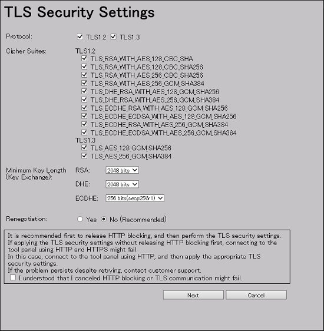
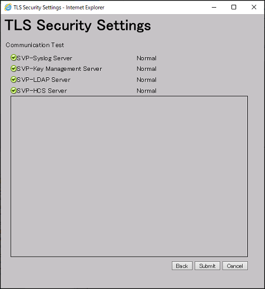

### TLS Setup
---

Setting SSL/TLS communications using the Tool Panel

Use the following procedure to create the security settings used for SSL/TLS communications with the SVP.

###### Caution:
		* If an SSL/TLS communication setting is not correct, SSL/TLS communication with the SVP might fail. If SSL communication fails, you need to configure the security settings again using the Tool Panel dialog box by using HTTP connection. Therefore, it is recommended to release the HTTP communication blocking using the Tool Panel dialog box before making security settings. For more information about how to release the HTTP communication blocking, see Releasing HTTP communication blocking.
		* When you perform this procedure, use HTTPS connection for access. If you access via an HTTP connection, the ID and password used for login are communicated in clear text.
		* If the self-signed certificates for the following communication paths are registered in the SVP, some of the test items are not verified in the communication test in this procedure:
			* SVP – Syslog Server
			* SVP – Key Management Server
			* SVP – LDAP Server
			* SVP – HCS server
		If this is the case, communication will be performed while security requirements are not met. Use certificates issued by trusted CA (Certificate Authority).

###### Before You Begin:
    * Verify the security settings of the SVP communication destination before the setting. If the protocol is TLS1.3 only, make sure that the communication destination supports TLS1.3.
      When you use Device Manager - Storage Navigator with Adobe AIR, you must enable TLS1.2. Adobe AIR does not support TLS1.3.
    * Verify that no other management or maintenance operations are being performed onDevice Manager - Storage Navigator.
    * You must have Security Administrator (View & Modify) role to perform this task.

###### Procedure:
1. Close all Device Manager - Storage Navigator sessions on the SVP.
2. On the management client, open a web browser, and then type the following URL to open the Tool Panel dialog box by using HTTPS connection.
		- https://IP-address-or-host-name-of-SVP/cgi-bin/utility/toolpanel.cgi
3. In the Tool Panel dialog box, click TLS Security Settings to open the TLS Security Settings login dialog box.
		- If SSL/TLS communication has been established, the Security Alert dialog box opens before the login dialog box opens. In the Security Alert dialog box, click OK.
		- If the Security Alert dialog box for the certificate opens, click View Certificate to display the certificate, confirm that the certificate is correct, and then click Yes.
4. In the TLS Security Settings login dialog box, enter the administrator user ID and password, and then click Login.
5. In the TLS Security Settings dialog box, enter the required items.

###### Caution:
		When using TLS1.2, select the cipher suites corresponding to the key type of the certificate uploaded to the SVP.
			* If the key type is RSA, select a cipher suite whose name contains “RSA”.
			* If the key type is ECDSA, select a cipher suite whose name contains “ECDSA”.
		If the cipher suites are not set correctly, the SSL/TLS communications with the SVP fail, and then a problem, such as a Device Manager - Storage Navigator login error, occurs.
		When using TLS1.3, you can select both cipher suites regardless of whether the certificate key type is RSA or ECDSA.

6. In the TLS Security Settings dialog box, confirm the messages about the possible TLS communication failures and recommendations, and then select the check box for I understood that I canceled HTTP blocking or TLS communication might fail.
7. Click Next to perform a communication test. The Communication Test dialog box for TLS Security Settings opens.
8. The communication test using the security settings specified in step 5 starts automatically for the following communication paths:
		- SVP – Syslog Server
		- SVP – Key Management Server
		- SVP – LDAP Server
		- SVP – HCS server
		The communication test verifies the following items:
		- Protocol
		- Cipher suites
		- Key length of the key exchange algorithm
		- Expiration date of the certificate
		- Certificate chain to the root CA certificate
9. Verify the results of the communication test for each communication path performed in the previous step. In the Communication Test dialog box for TLS Security Settings, wait until any of the following is displayed as the communication test result:
		- Normal: Communication is complete correctly.
		- Skipped: Connection settings are not made on Device Manager - Storage Navigator.
		- Error：Communication failed.
10. Confirm the communication test result, and then click Submit in the Communication Test dialog box for TLS Security Settings.
11. When prompted if you are sure you want to change the settings, click OK.
		The SVP web server restarts to reflect the security settings. When the SVP Web server restart is complete, the setting completion dialog box for TLS Security Settings opens.
12. Click OK to return to the login dialog box.
13. Back up the new security settings. For details, see Backing up HDvM - SN configuration files.

#### TLS Security Settings window
This section describes the TLS Security Settings window features and controls.

###### Protocol
	Protocols that is allowed to be used in the communication path. The following protocols are supported:
	TLS1.2
	TLS1.3

###### Cipher Suites
	Cipher Suites that are allowed to be used in the communication path. The following cipher suites are supported:
	TLS1.2
			TLS_RSA_WITH_AES_128_CBC_SHA
			TLS_RSA_WITH_AES_128_CBC_SHA256
			TLS_RSA_WITH_AES_256_CBC_SHA256
			TLS_RSA_WITH_AES_256_GCM_SHA384
			TLS_DHE_RSA_WITH_AES_128_GCM_SHA256
			TLS_DHE_RSA_WITH_AES_256_GCM_SHA384
			TLS_ECDHE_RSA_WITH_AES_128_GCM_SHA256
			TLS_ECDHE_RSA_WITH_AES_256_GCM_SHA384
			TLS_ECDHE_ECDSA_WITH_AES_128_GCM_SHA256
			TLS_ECDHE_ECDSA_WITH_AES_256_GCM_SHA384
	TLS1.3
			TLS_AES_128_GCM_SHA256
			TLS_AES_256_GCM_SHA384

###### Minimum Key Length (Key Exchange)
	Sets the minimum key length allowed for key exchange during the communications.
	
	The minimum key length supported by the key exchange algorithm set on the TLS Security Setting dialog box in the Tool Panel dialog box is applied when a certificate with RSA public key is set during the communications between the management client and the SVP.

	When the following cipher suites are valid, and when a server certificate, root certificate, or client certificate with an RSA public key is uploaded to the SVP, the key length of the RSA public key of the certificate must be longer than the key length selected on the TLS Security Setting dialog box in the Tool Panel dialog box.

    TLS_RSA_WITH_AES_128_CBC_SHA
    TLS_RSA_WITH_AES_128_CBC_SHA256
    TLS_RSA_WITH_AES_256_CBC_SHA256
    TLS_RSA_WITH_AES_256_GCM_SHA384
    
	When the SVP communicates with a Syslog server, key management server, external authentication and authorization server, or Hitachi Command Suite server, the key length of the key exchange key set on the server must satisfy the following:

    RSA: 2048 bits or more
    DHE: 2048 bits
    ECDHE: secp256r1, secp384r1, or secp521r1
    
	The supported key exchange algorithms have a minimum key lengths.

    RSA
        2048 bits
        3072 bits
        4096 bits
    DHE
        2048 bits
    ECDHE
        256 bits (secp256r1)
        384 bits (secp384r1)
        521 bits (secp521r1)

###### Renegotiation
	Sets whether to allow (Yes) or disallow (No (Recommended)) renegotiation.

#### TLS Security Settings Communication Test window
This section describes the TLS Security Settings Communication Test window features and controls.

###### Communication Test
	Tests whether TLS communication is enabled for the following communication paths:
	    SVP – Syslog Server
	    SVP – Key Management Server
	    SVP – LDAP Server
	    SVP – HCS server
	    
	The following icons and status indicate the status of each communication path during the Communication Test:
	    : Processing
	    : Normal
	    : Skipped
	    : Error
	    
	If a problem occurs during the Communication Test, an error message appears in the field on the dialog box.
	    : Waiting
