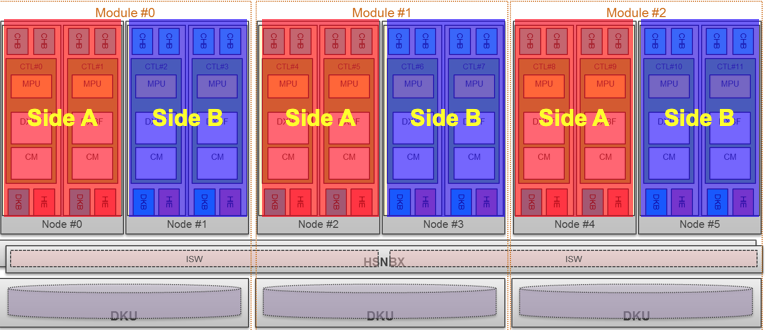
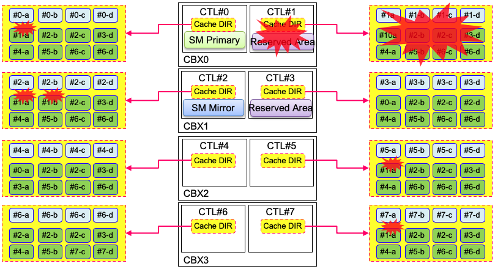
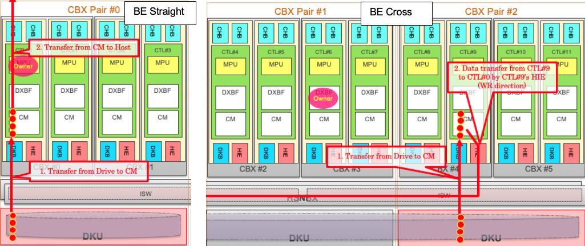
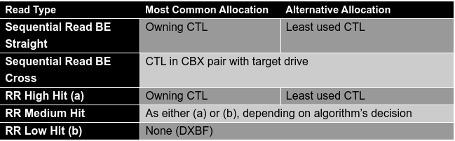
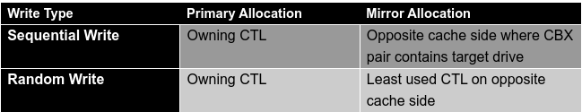
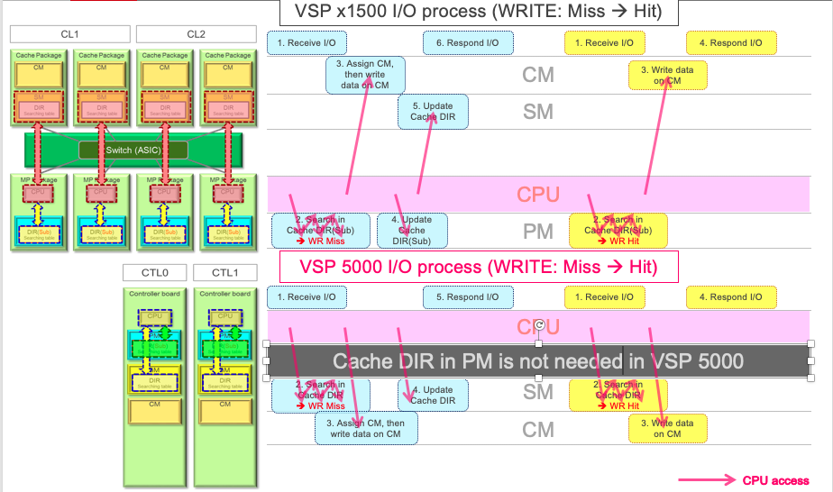
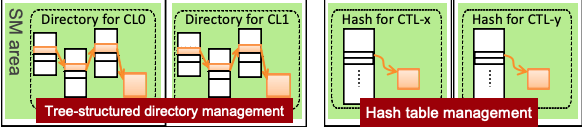

### VSP 5000 Cache Architecture Enables Industry-Leading Performance, Data Protection, and Efficiency
---
---

#### Introduction
---

Cache is at the heart of the VSP 5000 architecture. All data transferred between the host and VSP 5000 move though cache. Data can be retrieved from cache roughly 1000 times faster than from the fastest flash drive, permitting read response times as low as 70 microseconds. And because of cache, data can be written to the VSP 5000 with host response times as low as 140 microseconds. Hitachi cache architecture, newly improved for the VSP 5000 series, has three fundamental principles:
 
* Protect user data and maintain availability.
* Allocate cache efficiently.
* Optimize performance.

 
#### Protect User Data and Maintain Availability
---

Protecting customer data and ensuring it’s always available is central to Hitachi’s cache architecture. To achieve this goal, cache is divided into “A” and “B” sides residing on separate physical components, with each side having an independent power supply. Customer data are thereby protected from any single point of failure. In the event of a complete power loss, cache backup modules maintain power until cached data are safely backed up to dedicated SSDs.

**Figure 1.** Cache A and B sides, with independent power supplies, protect against any single point of failure.

To protect against a single failure point, all writes are mirrored to the A and B sides of cache. A write acknowledgment is sent to the host as soon as the cache mirroring is complete. In addition, a data integrity code, created by the fibre channel protocol chip for each 512B unit received from the host, is checked at each stage of the transfer to guard against data corruption.

The VSP 5000 cache directory system has been improved to virtually eliminate write through mode (a degraded state in which host writes cannot be acknowledged until data are stored on back end drives, usually causing significant performance degradation). In previous enterprise products, the cache directories employed a complicated tree structure that resided on dedicated cache boards. If a cache board failed, the cache entered write through mode until the directories could be reconstructed from the metadata on the intact cache packages. In the best case, write though mode would persist for several minutes until the cache directory reconstruction was complete. However in smaller configurations, write through mode would persist until the failed cache board was replaced. The VSP 5000 has a simpler and more resilient system for cache address lookups. Each controller has a hash table with pointers to cache addresses for the LDEVs it owns. Data for a controller’s LDEVs may reside in its own cache (more common) but could also reside in another controller’s cache. If a controller fails, each controller simply invalidates hash table entries that point to the failed controller, and write through mode becomes unnecessary.

**Figure 2.** If a controller fails (CTL-1 in this example), each remaining controller simply invalidates cache directory pointers to the failed controller’s cache.

VSP 5000 cache architecture also improves protection for the important shared memory region by maintaining a redundant copy of this metadata under nearly all conditions. Our previous enterprise architecture only maintained a single copy of shared memory if a primary cache board failed. Recovery of the shared memory mirror required the failed cache board to be replaced. With its improved architecture, the VSP 5000 can recover a shared memory mirror within a few minutes, without the need to wait for hardware maintenance. This is accomplished by keeping two reserved areas on the A and B sides of cache, in addition to the primary and mirror copies of shared memory.  As shown in Figure 3, these reserved areas stand ready to receive a copy of shared memory from the intact controller in the event of hardware or power failure. Thanks in significant measure to its superior cache architecture, the VSP 5000 Series delivers industry-leading 99.999999% availability.

**Figure 3.** Because of reserved areas on different power boundaries, a redundant copy of shared memory can be recovered within a few minutes.

#### Manage Cache Efficiently
---

The VSP 5000 maximizes the value of cache by managing it efficiently. VSP 5000 cache is a global resource, allowing any controller to access another controller’s memory via hardware-assisted direct memory addressing (DMA). The global cache architecture eliminates the need for wasteful and expensive cache mirroring of both read and write data across all controllers (as done by some enterprise competitors). The VSP 5000 mirrors writes in cache on two controllers, while reads are cached on one controller. Cache for sequentially accessed data is usually returned to the free pool quickly after I/O completion. This is the most efficient use of cache, since sequentially accessed data has a relatively low probability of repeated access. Randomly read data will be retained in cache on a most recently used basis (additional details below). Caching randomly read data is a very effective use of cache, because the host can read from cache at least 1000 times more quickly than from a back end drive. Primary and mirror copies of randomly written data will also be retained in cache for a period of time as a performance optimization. VSP 5000 efficient cache management is implemented as follows:
 
1. **Use cache efficiently by balancing allocation across controllers**: According to this policy, cache for host I/O will usually be allocated on the controller that owns the LDEV. When LDEV ownership is distributed evenly across controllers, cache allocation on the owning controller usually results in balanced cache utilization. Another benefit of such allocation is that a controller can access its own cache with the least overhead.
2. **Maximize performance by avoiding unnecessary internal data transfers as much as possible**: In some cases (detailed below) cache will be allocated on a non-owning controller to avoid an extra inter-controller data transfer. 

I/O is periodically sampled and analyzed for each logical device, and cached in the most efficient and performant way for each type of I/O described below: 
 
* **Sequential Read**: Sequential read caching depends on the physical location of the data being read.
	* **Back End Straight**: If the data are on a drive in the same CBX pair as the controller that owns the target LDEV (Figure 4 left), cache will usually be allocated in the owning controller (balancing cache utilization evenly). A non-owning controller might be chosen according to the least-used policy, if this achieves better balance in cache utilization.
	* **Back End Cross**: If the data are on a drive in a different CBX pair from the owning controller (Figure 4 right), cache will be allocated on a controller in the CBX pair that contains the drive to avoid an extra inter-controller transfer.

**Figure 4.** BE Straight: Allocate Cache on Owning CTL.  BE Cross: Allocate Cache in CBX Pair with Target Drive.

 
* **Random Read High Hit Rate (50% or more)**: Usually cache will be allocated in the owning controller, but a non-owning controller might be chosen if this balances cache allocation more evenly.
* **Random Read Low Hit Rate (16% or less)**: Cache will not be allocated for this type of I/O, because the probability of subsequent read hits is low. Instead, data will be transferred via a dedicated buffer (DXBF) to the host, thus avoiding the overhead of cache allocation. Our testing shows that random read workloads with a low cache hit rate perform better when data are sent directly to the host via DXBF, without the extra steps needed to cache the requested data.
* **Random Read Medium Hit Rate (17% to 49%)**: This type of I/O will be analyzed by intelligent algorithms and categorized as high or low, then cached or transferred directly as described above.
* **Sequential Write**: The logic is similar to sequential read cache allocation (see Figure 4 above), but it is applied to both the primary and mirrored copies of data.
	* Primary: Cache will be allocated on the owning controller for balanced cache utilization and fast access.
	* Mirror: The mirrored copy will be on the opposite side of cache (A/B) from the primary copy. Also, the mirrored cache will be allocated on a controller in the CBX pair that contains the target drive, to avoid an extra inter-controller transfer. 
* **Random Write**: Cache allocation for random writes is described in Table 2 below.

**Table 1.** Cache Allocation for Reads

**Table 2.** Cache Allocation for Writes

#### Optimize Performance
---

Because cache is by far the fastest storage medium, performance optimization is the most fundamental goal of VSP 5000 cache architecture.  In this section we’ll discuss several basic cache algorithms for high performance: write-behind cache, gathering write, and sequential read pre-fetch. Next we’ll examine the performance advantages of the VSP 5000 tightly coupled scale-out architecture, in which cache is a global resource, readily accessible by any controller. Finally, we’ll discuss two cache-related performance optimizations that are new for VSP 5000.

Most of the time, VSP 5000 cache operates in write-behind mode, meaning that the host is notified of command completion as soon as cache mirroring is done, even though data may not yet have been written to back end drives. The primary advantage of write-behind operation is consistently fast response times under normal operating conditions. After acknowledging the host write, randomly written data are held in cache and monitored by the gathering write algorithm.  Gathering write improves random write performance by reducing required CPU and drive operations as much as possible. For example, storing a single 8K block on a RAID-6 parity group requires six physical operations (read old data, read old parity P, read old parity Q, write new data, write new parity P, write new parity Q). And of course, storing two 8K blocks individually would require twelve physical operations. However, if data are held until two adjacent 8K blocks have been cached, then a single 16K unit can be written, thus halving the number of required CPU and drive operations. Finally, sequential read pre-fetch boosts throughput by predicting in advance which data the host will request when a sequential read pattern is detected. Data will be staged into cache so that they are ready for immediate host access as soon as the predicted read command arrives.

Earlier we mentioned that each VSP 5000 controller’s memory is a global resource, accessible by any other controller in a tightly coupled scale-out architecture. Now, let’s discuss why the tightly coupled scale-out system gives the VSP 5000 a performance advantage. SVOS directs incoming host I/O commands to the controller that owns the target logical device. For optimal performance, SVOS prioritizes cache allocation in the owning controller. However, to use cache as efficiently as possible, the requested data may sometimes be cached in a different controller. The tightly coupled VSP 5000 architecture allows a controller to rapidly search its own cache directory to find out whether a cache hit has occurred, even if the requested data are cached on a different controller. The more loosely coupled scale out architecture used by many competitors would require the owning controller to query other controllers about cache residency, which consumes CPU cycles and adds latency. The VSP 5000 architecture allows a controller to efficiently determine the fastest method of data retrieval using only its own local resources.

Let’s next discuss a couple of cache-related performance enhancements that are new for VSP 5000. First, the metadata used for finding cached data has been simplified to reduce management overhead. Previously, cache directories were duplicated on dedicated cache boards as well as in the controllers’ local memory (a.k.a. package memory). This system allowed fast access by each controller to its local cache directory, but it required updates to both directories whenever a cache miss occurred. As shown in Figure 5, the VSP 5000 has adopted a simpler system where each controller manages the cache directory for the LDEVs it owns in its local memory, eliminating the need for duplicate cache directory updates.

**Figure 5.** VSP 5000 eliminates the need for redundant cache directory updates when a cache miss occurs (a 17% reduction in number of operations)

Second, the cache directory structure has been changed from a tree structure to a hash table for faster searches. When host I/O commands are routed to the controller that owns the target LDEV, the controller quickly determines the cache hit/miss status by searching its local cache directory. If the requested address is cached in any controller (a cache hit), the owning controller will find that address in its local directory. If a cache miss occurs, cache will be assigned as described in tables 1-2, and a directory update will be made in the local cache directory.

**Figure 6.** VSP 5000 streamlined cache management allows for faster directory searches

We’ve briefly reviewed how the VSP 5000 cache architecture protects data integrity and availability, manages resources efficiently, and optimizes performance. For additional information about VSP 5000 architecture and performance see the VSP 5000 home page.
