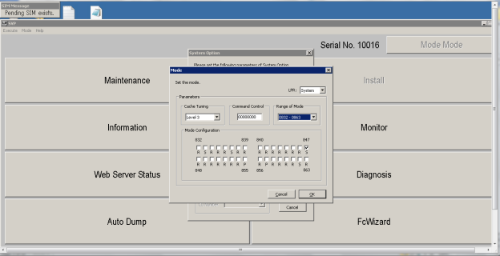
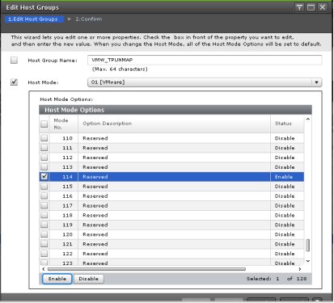
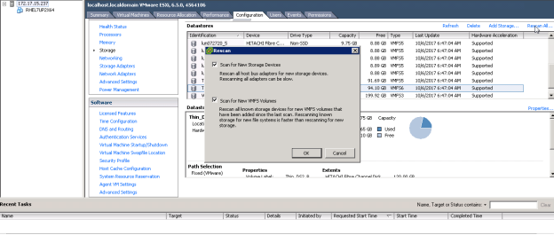

### Initial Setup for Automated UNMAP on VSP G-F Storage
---
---

##### 1. Enable Active UNMAP
---

1. Set HMO63 to activate UNMAP.
2. Set SOM847 to ON.

3. Set HMO114 to ON.
 

4. Set SOM847 to OFF.

##### 2. “Rescan all” is performed on vmhbas
---

##### 3. Optional , Execute the command
---

To check that inquiry data from VSP G is reporting 256KB UNMAP Granularity (i.e Byte 28-31 shows changed values after rescan and with HMO 114 enabled.
	
	vsish -e cat /storage/scsifw/devices/naa.60060e80072720000030272000000032/inquiryVPD/176/data

