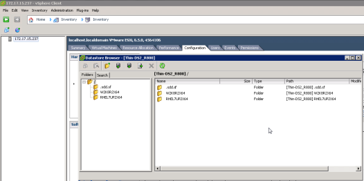
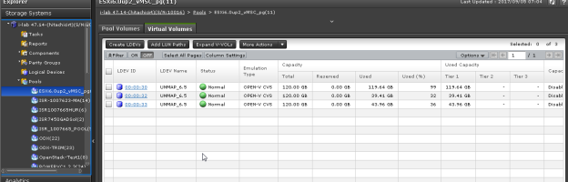
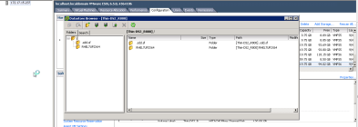
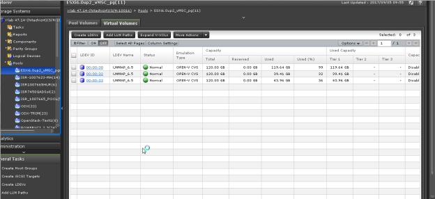

### Use Case 1. Observe automatic space reclaim after VM deletion
---
---

Sample Test Setup Details:

##### 1. Deploy a VM on a VMFS6 datastore
---

(internal test :-  Datastore: VM “W2K8R2X64” created on Thin_DS2_R800 (VMFS6) datastore; VMDK size in test case was 100+GB)

Example: Virtual Volume”00:32” is volume behind the Thin_DS2_R800 datastore

##### 2. Delete the VM
---

VM “W2K8R2X64” on Thin_DS2_R800 is deleted: 

##### 3. Check if a pool capacity was decreased, Pool capacity decrease time varies from 30 mins to 1 hour
---

**Note:**

	We have seen instances where ESXi hosts can take up to 24 hours or more and working with VMware to understand instances for that behavior

	