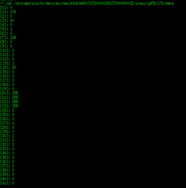

### APPENDIX
---
---

#### Troubleshooting – Example outputs
---

##### vdisk2 (/dev/sdb) – virtual disk from Thin LU
		[root@localhost ~]# sg_vpd --page=0xb0 /dev/sdb -vvv
		open /dev/sdb with flags=0x800
			inquiry cdb: 12 01 b0 00 fc 00 
			  duration=0 ms
		Block limits VPD page (SBC):
		   [PQual=0  Peripheral device type: disk]
		  Write same no zero (WSNZ): 0
		  Maximum compare and write length: 0 blocks
		  Optimal transfer length granularity: 0 blocks
		  Maximum transfer length: 0 blocks
		  Optimal transfer length: 0 blocks
		  Maximum prefetch length: 0 blocks
		  Maximum unmap LBA count: 65536
		  Maximum unmap block descriptor count: 64
		  Optimal unmap granularity: 2048
		  Unmap granularity alignment valid: 1
		  Unmap granularity alignment: 0
		  Maximum write same length: 0x0 blocks
		[root@localhost ~]# 
		[root@localhost ~]# 
		
	 [root@localhost ~]# sg_vpd --page=0xb2 /dev/sdb -vvv
	open /dev/sdb with flags=0x800
		inquiry cdb: 12 01 b2 00 fc 00 
		  duration=0 ms
	Logical block provisioning VPD page (SBC):
	   [PQual=0  Peripheral device type: disk]
	  Unmap command supported (LBPU): 1
	  Write same (16) with unmap bit supported (LBWS): 0
	  Write same (10) with unmap bit supported (LBWS10): 0
	  Logical block provisioning read zeros (LBPRZ): 1
	  Anchored LBAs supported (ANC_SUP): 0
	  Threshold exponent: 1
	  Descriptor present (DP): 0
	  Provisioning type: 2

##### vdisk3 (/dev/sdc) - RDM
	[root@localhost ~]# sg_vpd --page=0xb0 /dev/sdc -vvv
	open /dev/sdc with flags=0x800
		inquiry cdb: 12 01 b0 00 fc 00 
		  duration=0 ms
	Block limits VPD page (SBC):
	   [PQual=0  Peripheral device type: disk]
	  Write same no zero (WSNZ): 0
	  Maximum compare and write length: 1 blocks
	  Optimal transfer length granularity: 128 blocks
	  Maximum transfer length: 0 blocks
	  Optimal transfer length: 86016 blocks
	  Maximum prefetch length: 0 blocks
	  Maximum unmap LBA count: 4294967295
	  Maximum unmap block descriptor count: 1
	  Optimal unmap granularity: 512
	  Unmap granularity alignment valid: 0
	  Unmap granularity alignment: 0
	  Maximum write same length: 0x0 blocks
	[root@localhost ~]# 

#### Execute the following command to check an inquiry data.
---

	vsish -e cat /storage/scsifw/devices/naa.60060e80072720000030272000000032/inquiryVPD/176/data

