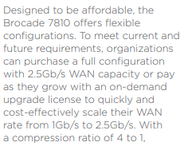

### FCIP CONFIGURATION
---
---

#### EXAMPLE 1
---

##### 1. Configure IPs & Routes
	Site Atlas
		FCIP01
			portcfg ipif ge2.dp0 create 10.198.86.14 netmask 255.255.255.0 mtu 9000
			portcfg ipif ge3.dp0 create 10.198.86.15 netmask 255.255.255.0 mtu 9000
			portcfg iproute ge2.dp0 create 10.145.86.0 netmask 255.255.255.0 10.198.86.1
			portcfg iproute ge3.dp0 create 10.145.86.0 netmask 255.255.255.0 10.198.86.1
		
		FCIP02
			portcfg ipif ge2.dp0 create 10.198.86.16 netmask 255.255.255.0 mtu 9000
			portcfg ipif ge3.dp0 create 10.198.86.17 netmask 255.255.255.0 mtu 9000
			portcfg iproute ge2.dp0 create 10.145.86.0 netmask 255.255.255.0 10.198.86.1
			portcfg iproute ge3.dp0 create 10.145.86.0 netmask 255.255.255.0 10.198.86.1

	Site Pasifik
		FCIP01
			portcfg ipif ge2.dp0 create 10.145.86.14 netmask 255.255.255.0 mtu 9000
			portcfg ipif ge3.dp0 create 10.145.86.15 netmask 255.255.255.0 mtu 9000
			portcfg iproute ge2.dp0 create 10.198.86.0 netmask 255.255.255.0 10.145.86.1
			portcfg iproute ge3.dp0 create 10.198.86.0 netmask 255.255.255.0 10.145.86.1
		
		FCIP02
			portcfg ipif ge2.dp0 create 10.145.86.16 netmask 255.255.255.0 mtu 9000
			portcfg ipif ge3.dp0 create 10.145.86.17 netmask 255.255.255.0 mtu 9000
			portcfg iproute ge2.dp0 create 10.198.86.0 netmask 255.255.255.0 10.145.86.1
			portcfg iproute ge3.dp0 create 10.198.86.0 netmask 255.255.255.0 10.145.86.1

##### 2. Create Tunnels
	Site Atlas
		portcfg fciptunnel 24 create
	
	Site Pasifik
		portcfg fciptunnel 24 create

##### 3. Create Circuits
	Site Atlas
		FCIP01
			portcfg fcipcircuit 24 create 0 --remote-ip 10.145.86.14 --local-ip 10.198.86.14 -b 10000000 -B 10000000
			portcfg fcipcircuit 24 create 1 --remote-ip 10.145.86.15 --local-ip 10.198.86.15 -b 10000000 -B 10000000
		
		FCIP02
			portcfg fcipcircuit 24 create 0 --remote-ip 10.145.86.16 --local-ip 10.198.86.16 -b 10000000 -B 10000000
			portcfg fcipcircuit 24 create 1 --remote-ip 10.145.86.17 --local-ip 10.198.86.17 -b 10000000 -B 10000000
	
	Site Pasifik
		FCIP01
			portcfg fcipcircuit 24 create 0 --remote-ip 10.198.86.14 --local-ip 10.145.86.14 -b 10000000 -B 10000000
			portcfg fcipcircuit 24 create 1 --remote-ip 10.198.86.15 --local-ip 10.145.86.15 -b 10000000 -B 10000000
		
		FCIP02
			portcfg fcipcircuit 24 create 0 --remote-ip 10.198.86.16 --local-ip 10.145.86.16 -b 10000000 -B 10000000
			portcfg fcipcircuit 24 create 1 --remote-ip 10.198.86.17 --local-ip 10.145.86.17 -b 10000000 -B 10000000

##### 4. Check All
	Tunnel must be up
		portshow fciptunnel all
		portshow fcipcircuit all
	
	Ports must be online and show remote switch name 
		switchshow
		
##### 5. Set Port Speed if You Need (OPTIONAL)
	portcfg fciptunnel 12 modify -b 10000000 -B  10000000

##### 6. Set QOS (OPTIONAL)
	portcfg fciptunnel 26 modify --qos-bw-ratio 10,80,10
	portshow fcipcircuit all --qos

#### EXAMPLE 2
---

	PRIMARY	:	IST switch 1 --198.27 
	SECONDARY :	ANK switch 1 --32.116

##### 1. Configure IPs & Routes
	Disable Network Ports on both Sites
		portdisable ge2
		portdisable ge3
		portdisable ge4
		portdisable ge5
		
	IST switch 1 --198.27
		portcfg ipif ge2.dp0 create 10.124.128.101 netmask 255.255.255.0 mtu 1500
		portcfg ipif ge3.dp0 create 10.124.128.102 netmask 255.255.255.0 mtu 1500
		portcfg ipif ge4.dp0 create 10.124.128.103 netmask 255.255.255.0 mtu 1500
		portcfg ipif ge5.dp0 create 10.124.128.104 netmask 255.255.255.0 mtu 1500

	ANK switch 1 --32.116
		portcfg ipif ge2 create 10.124.128.121 netmask 255.255.255.0 mtu 1500
		portcfg ipif ge3 create 10.124.128.122 netmask 255.255.255.0 mtu 1500
		portcfg ipif ge4 create 10.124.128.123 netmask 255.255.255.0 mtu 1500
		portcfg ipif ge5 create 10.124.128.124 netmask 255.255.255.0 mtu 1500

	Add route if It is necessary
		portcfg iproute ge2.dp0 create <dest_net> netmask <netmask> <gw>

	Enable Network Ports on both Sites
		portenable ge2
		portenable ge3
		portenable ge4
		portenable ge5

	Try "ping" from one site to another (IST switch 1 --198.27)
		portcmd --ping -s 10.124.128.101 -d 10.124.128.121
		portcmd --ping -s 10.124.128.102 -d 10.124.128.122
		portcmd --ping -s 10.124.128.103 -d 10.124.128.123
		portcmd --ping -s 10.124.128.104 -d 10.124.128.124

	Disable Network Ports on both Sites
		portdisable ge2
		portdisable ge3
		portdisable ge4
		portdisable ge5

##### 2. Create Tunnels
	Run "switchshow" and find first available VE port (12 for 7810)

	IST switch 1 --198.27
		portcfg fciptunnel 12 create -c deflate

	ANK switch 1 --32.116
		portcfg fciptunnel 12 create -c deflate

##### 3. Create Circuits & Enable Ports
Check FCIP switch specs and find WAN capacity. Below exapmle shows that FCIP switch has **2.5Gb/s** and it is **2.5Gb/4 = 625000Kb** per circuit.

	
	IST switch 1 --198.27
		portcfg fcipcircuit 12 create 0 --remote-ip 10.124.128.121 --local-ip 10.124.128.101 -b 625000 -B 625000
		portcfg fcipcircuit 12 create 1 --remote-ip 10.124.128.122 --local-ip 10.124.128.102 -b 625000 -B 625000
		portcfg fcipcircuit 12 create 2 --remote-ip 10.124.128.123 --local-ip 10.124.128.103 -b 625000 -B 625000
		portcfg fcipcircuit 12 create 3 --remote-ip 10.124.128.124 --local-ip 10.124.128.104 -b 625000 -B 625000

	ANK switch 1 --32.116
		portcfg fcipcircuit 12 create 0 --remote-ip 10.124.128.101 --local-ip 10.124.128.121 -b 625000 -B 625000
		portcfg fcipcircuit 12 create 1 --remote-ip 10.124.128.102 --local-ip 10.124.128.122 -b 625000 -B 625000
		portcfg fcipcircuit 12 create 2 --remote-ip 10.124.128.103 --local-ip 10.124.128.123 -b 625000 -B 625000
		portcfg fcipcircuit 12 create 3 --remote-ip 10.124.128.104 --local-ip 10.124.128.124 -b 625000 -B 625000
	
	Enable Ports on both Sites
		portenable ge2
		portenable ge3
		portenable ge4
		portenable ge5

##### 4. Check All
	Tunnel must be up
		portshow fciptunnel all
		portshow fcipcircuit all
	
	Ports must be online and show remote switch name 
		switchshow

##### 5. Set Port Speed if You Need (OPTIONAL)
	portcfg fciptunnel 12 modify -b 10000000 -B  10000000

##### 6. Set QOS (OPTIONAL)
	portcfg fciptunnel 26 modify --qos-bw-ratio 10,80,10
	portshow fcipcircuit all --qos

#### ADDITIONAL COMMANDS
---

##### Port Speed Change
	portcfg fciptunnel 12 modify -b 10000000 -B  10000000

##### QOS Change
	portcfg fciptunnel 26 modify --qos-bw-ratio 10,80,10
	portshow fcipcircuit all --qos

##### Show IP addresses
	portshow ipif ge1

##### Show Routes
	portshow iproute

##### Show Tunnel
	portShow fciptunnel all -tcp
	portshow fciptunnel all -c

##### Ping
	portcmd --ping ge2 -s 10.124.128.101 -d 10.124.128.121

##### Traceroute
	portcmd --traceroute ge2 -s 10.124.128.101 -d 10.124.128.121

##### Deleting Configuration
	portcfg fcipcircuit 12 delete 0
	portcfg fciptunnel 12 delete
	portcfg iproute ge0 delete 172.16.0.0 netmask 255.255.0.0
	portcfg ipif ge0 delete 172.19.20.229 netmask 255.255.255.0
	